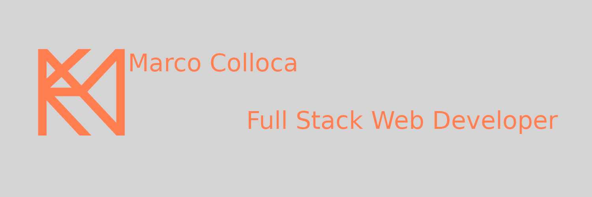
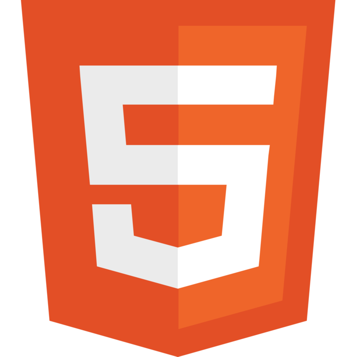
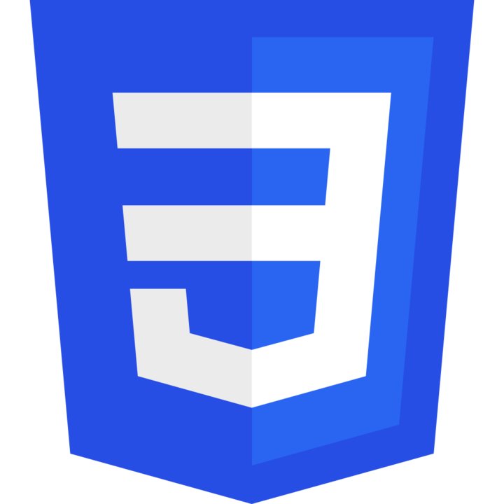
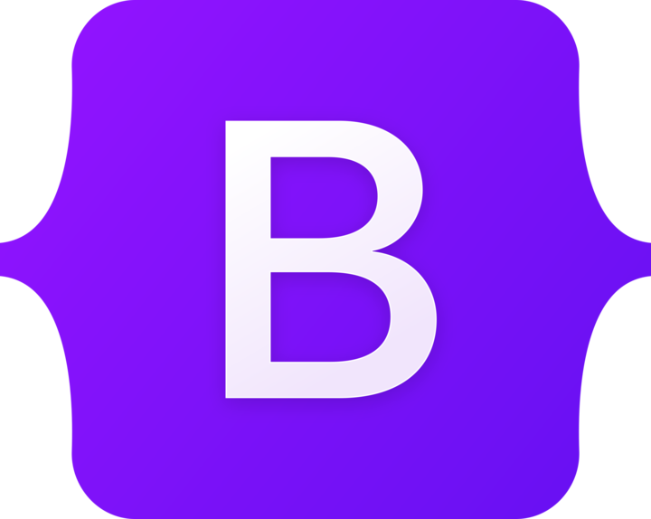
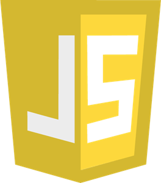
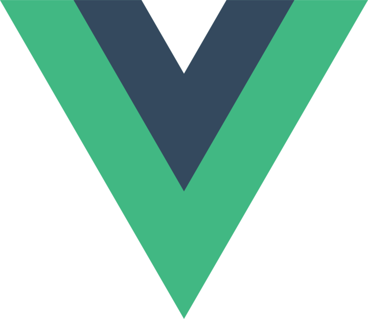
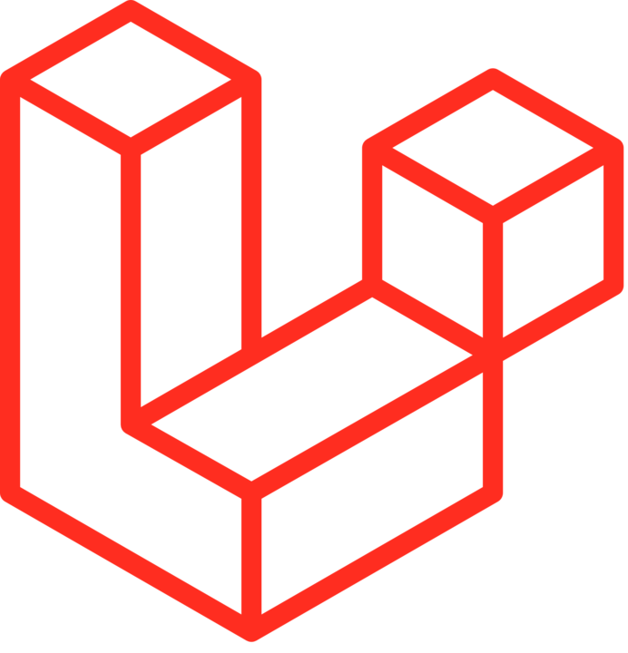
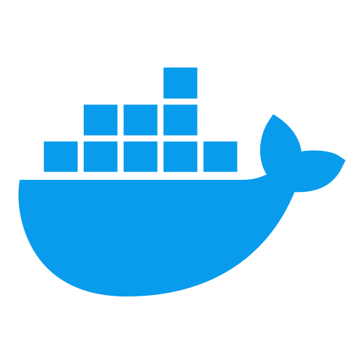
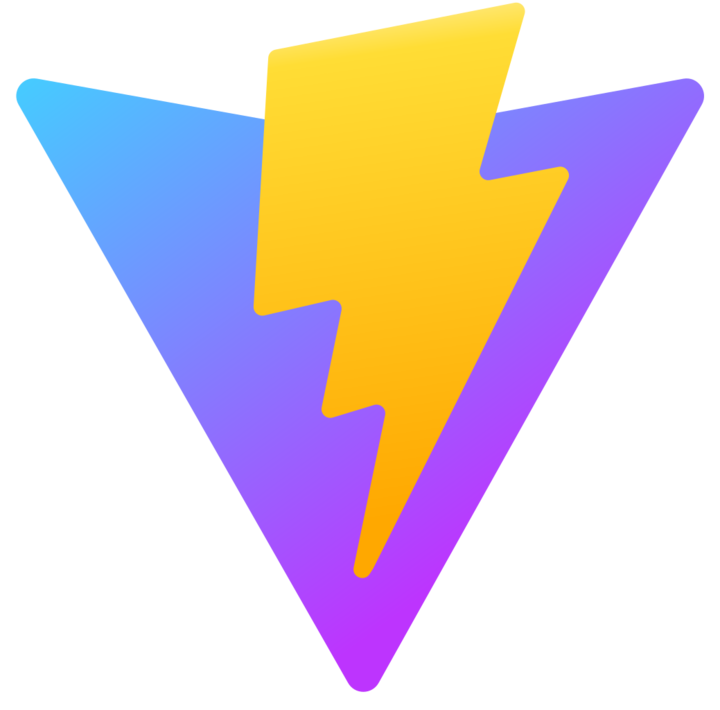

# Hello! I'm Marco Colloca, but my friends call me Mark. 👋

---

My journey has been quite diverse:

- **Passion for Technology**: From a young age, I have always been passionate about technology, role-playing games, and video games.
  
- **Educational Background**: My studies led me towards **Photography** and **Cinematography**.

- **Professional Experience**: For many years, I relied on the "safe harbor" of my family's small camping goods store.

---

After several years, I decided to leave that security behind and embark on a new adventure: **programming**. Thanks to the Boolean course in **Full-Stack Web Development**, I have acquired many skills in both **Front-End** and **Back-End** development. My ambition is to continue growing and expanding my knowledge to become a well-rounded web developer.

     

# Skills ⚡
### These are some of the languages, frameworks, and other technologies I have learned during my time as a programmer. I don't consider myself an expert, but I have a solid foundation that enables me to work effectively.
-   HTML

-   CSS
 

        
-    Scss
 

-   Bootstrap
 

    
-   JavaScript
 

    
-   Vue
 

    
-    PHP
 

    
-   Laravel
 

        
-   MySql
 

-  Docker    
 

-    Vite
 
    

   

# Currently Learning 🤔
### These are some of the languages, frameworks, and other technologies I'm currently studying, i know the basics, but i still need time to master their secrets.

-  gsap

    
        

 

   

# How to reach me 🔭

- <a href="https://www.linkedin.com/in/marco-colloca-35ab28314/">Linkedin</a>

   

# Works I'm Proud ✨
- <a href="https://farrealms.netlify.app/">Far Realms</a>

<!--
**MarcoColloca/MarcoColloca** is a ✨ _special_ ✨ repository because its `README.md` (this file) appears on your GitHub profile.

Here are some ideas to get you started:

- 🔭 I’m currently working on ...
- 🌱 I’m currently learning ...
- 👯 I’m looking to collaborate on ...
- 🤔 I’m looking for help with ...
- 💬 Ask me about ...
- 📫 How to reach me: ...
- 😄 Pronouns: ...
- ⚡ Fun fact: ...
-->
